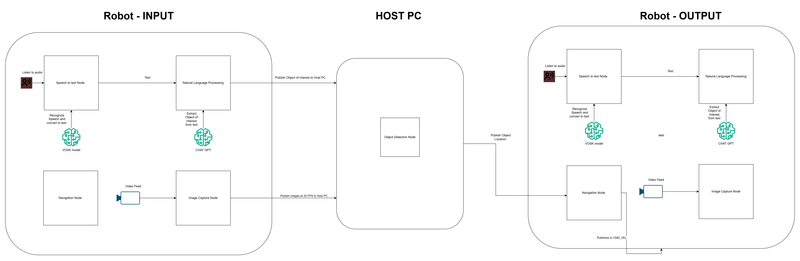

# Voice-Activated Object Navigation Robot

## Overview

This project, developed as part of **CSCI 585 Robotics and Machine Intelligence** at **California State University, Chico**, focuses on building a **voice-activated robot** that detects and navigates toward specified objects based on voice commands. The system integrates **speech recognition, natural language processing (NLP), object detection, and navigation** using **ROS2** on a **TurtleBot3 Waffle Pi**.

## Features

- **Speech Recognition:** Uses the **Vosk model** to convert voice commands to text.
- **Natural Language Processing (NLP):** Extracts objects of interest using **ChatGPT API**.
- **Object Detection:** Implements **YOLO v8** to detect objects in real-time.
- **Navigation:** Uses proportional steering to dynamically adjust the robot’s movement.
- **Integration with ROS2:** Ensures seamless communication between modules.

## System Architecture

### **Robot - INPUT**
1. **Speech-to-Text Node:** Converts voice commands into text.
2. **NLP Processing:** Extracts the object of interest from text.
3. **Image Capture Node:** Captures real-time video feed.
4. **Publish Data to Host PC:** Sends object of interest and video frames.

### **Host PC**
1. **Object Detection Node:** Identifies and locates the specified object.
2. **Publish Object Location:** Sends detected object's position back to the robot.

### **Robot - OUTPUT**
1. **Navigation Node:** Uses object location to navigate toward the target.
2. **Real-Time Adjustments:** Dynamically corrects path using visual feedback.

## 📽️ Video Demonstrations

1. **Final Robot Object Tracking** – Demonstrates the robot tracking objects.
   👉 [Watch Here](https://drive.google.com/file/d/1ZEAZ1pQFcCNqv_c8xPDhY8eA1_N8mXMp/view?usp=drive_link)

2. **Object Detection and Navigation** – Shows the object detection and navigation process.
   👉 [Watch Here](https://drive.google.com/file/d/1MSB5O2HxTpIlxtPQPRu48jqqAd3hz2DC/view?usp=drive_link)

3. **Voice Command Movement** – Demonstrates movement based on voice commands.
   👉 [Watch Here](https://drive.google.com/file/d/1Li1vEvDu3cfABLnCjPydYhaR8y3Ql60m/view?usp=drive_link)

4. **Full Video Collection** – Access all project-related videos in one place.  
   📂 **Google Drive Folder:** [View All Videos](https://drive.google.com/drive/folders/1-5WzHlL9R6ly-ihHBvyknELdV5FMCE2Y?usp=drive_link)

